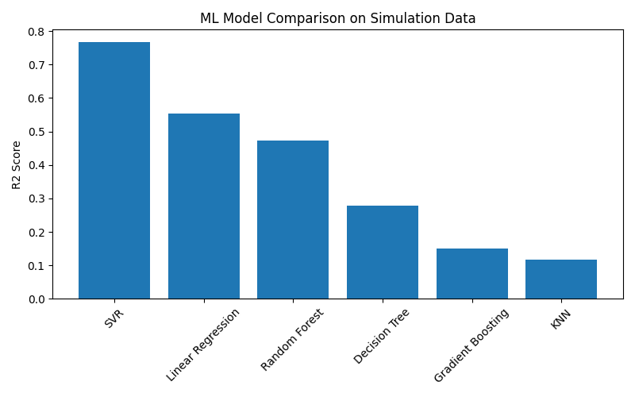

# Assignment: Data Generation using Modelling and Simulation for Machine Learning

## 📌 Overview
This project demonstrates how **modelling and simulation** can be used to generate synthetic data for **machine learning** applications.  
A **queue system** was simulated using the **SimPy** library, and the generated data was used to train and compare multiple machine learning models to identify the best-performing one.

---

## 🛠 Simulation Tool Used
- **Tool / Library:** SimPy  
- **Type:** Python-based discrete-event simulation library  
- **Simulation Model:** Single-server queue system  

SimPy was chosen because it enables realistic modelling of event-driven systems such as queues, servers, and customer waiting times.

---

## ⚙️ Simulation Parameters and Bounds

| Parameter | Description | Lower Bound | Upper Bound |
|---------|-------------|-------------|-------------|
| arrival_rate | Customer arrival rate (customers per unit time) | 1 | 10 |
| service_rate | Service rate (customers per unit time) | 2 | 15 |
| queue_capacity | Maximum queue size | 5 | 50 |
| simulation_time | Total simulation duration | 100 | 1000 |

Random values within these bounds were generated for each simulation run.

---

## 🔁 Data Generation Methodology
- A total of **1000 simulations** were executed.
- For each simulation:
  - Random parameters were generated within defined bounds
  - The queue system was simulated using SimPy
  - **Average waiting time** was recorded
- The final dataset contains **1000 rows and 5 columns**.

**Target Variable:** `avg_waiting_time`

---

## 🤖 Machine Learning Models Evaluated
The following regression models were trained and evaluated on the simulated dataset:

- Linear Regression  
- Decision Tree Regressor  
- Random Forest Regressor  
- Gradient Boosting Regressor  
- K-Nearest Neighbors (KNN)  
- Support Vector Regressor (SVR)

---

## 📊 Model Comparison Results

| Model | R² Score | RMSE | MAE |
|------|---------|------|-----|
| **SVR** | **0.7659** | **0.2537** | **0.1615** |
| Linear Regression | 0.5529 | 0.3506 | 0.2803 |
| Random Forest | 0.4736 | 0.3804 | 0.2000 |
| Decision Tree | 0.2776 | 0.4456 | 0.2332 |
| Gradient Boosting | 0.1511 | 0.4830 | 0.2165 |
| KNN | 0.1180 | 0.4924 | 0.2114 |

---

## 📈 Model Performance Visualization
The following graph compares different machine learning models based on their **R² score**:

---

## 🏆 Best Model
**Support Vector Regression (SVR)** performed the best because:
- It achieved the **highest R² score**
- It produced the **lowest RMSE and MAE**
- It generalized well on simulation-generated data

---

## ✅ Conclusion
This assignment demonstrates that **modelling and simulation** can be effectively used to generate synthetic datasets suitable for machine learning tasks.  
Among all evaluated models, **Support Vector Regression (SVR)** delivered the best overall performance on the simulated queue system data.

---

## 📁 Repository Structure
- `data/` – Simulation-generated dataset (`simulation_data.csv`)
- `notebook/` – Jupyter notebook containing simulation and ML implementation
- `images/` – Model comparison graphs and visualizations
- `README.md` – Project documentation
